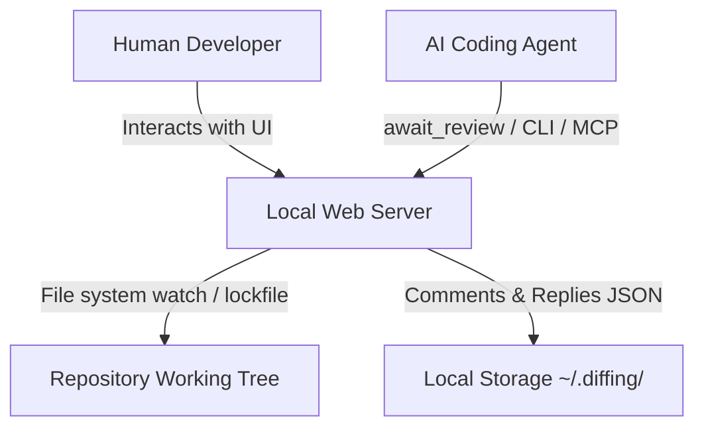

# Diffing CLI Reference Manual

This manual provides a detailed technical reference for the `diffing` command-line interface, its Model Context Protocol (MCP) server, and the underlying agent-user handoff protocol.

---

## 1. Core Concepts & Architecture

`diffing` is designed as a local-first, double-sided utility that serves both human developers and AI coding agents.



### Output Mode Auto-Detection
The primary `diffing` command determines how to output diff results based on whether stdout is interactive (a TTY) or a pipe/redirect:
- **Web Mode** (Default for interactive TTY): Launches a local review server, writes a discovery lockfile, and opens the browser with a high-fidelity PR-style review UI.
- **Terminal Mode** (Default for pipes, redirects, or non-TTY outputs): Behaves exactly like `git diff`. The command outputs standard patch text directly to stdout and exits.

You can explicitly force either mode using flags:
- `--web`: Forces the launching of the web review server.
- `--terminal`: Forces standard `git diff` output to terminal.

*Note: Any output format control flags (e.g. `--raw`, `--numstat`, `--stat`, `--exit-code`, `--quiet`, or `--output`) will implicitly force Terminal Mode.*

---

## 2. Port-Agnostic Server Discovery

When a `diffing` web server starts, it automatically registers itself by writing a lightweight lockfile (`server.json`) to a unique, repository-specific storage folder. 

This enables all agent subcommands, custom scripts, and the MCP server to find and communicate with the active web server without requiring the port to be hardcoded or passed manually.

### The Lockfile Location
The storage directory is computed by hashing the absolute path of the repository root:
```text
~/.diffing/<repo-name>-<sha256(repo-root-path).slice(0, 8)>/server.json
```

### Lockfile Schema
```json
{
  "port": 3433,
  "host": "127.0.0.1",
  "pid": 45192,
  "repoRoot": "/Users/developer/projects/my-app",
  "startedAt": 1782782782782,
  "version": "0.1.0"
}
```

### Self-Healing & Validation
To ensure stale lockfiles from terminated or crashed server processes do not block the CLI, client subcommands check the lock's validity via `isLockAlive`:
1. It probes the process using `process.kill(pid, 0)` (which checks for process existence without sending a termination signal).
2. It validates that the repository path registered in the lockfile matches the repository context of the executing CLI process.

If the lock fails either check, it is treated as dead, and the client reports that no server is running.

---

## 3. Command Line Interface Reference

### `diffing` (Primary Command)

Launches the review server or outputs terminal diffs. It serves as a drop-in replacement for `git diff` and accepts all standard git revisions, options, and pathspecs.

```bash
diffing [options] [<revision>...] [-- <path>...]
```

#### Diffing Server Options
- `--port <port>`: The port to bind the server to. If omitted, it automatically requests a random available port.
- `--host <host>`: Host address to bind the server to (default: `127.0.0.1`). Pass `0.0.0.0` to expose the review dashboard to your local network.
- `--no-open`: Prevents the CLI from automatically launching your browser when the server starts.

#### Git-Compatible Flags Supported
- **Revisions / Range**: `--staged`, `--cached`, `--merge`
- **Diff Algorithms**: `--diff-algorithm=<algo>` (`minimal`, `patience`, `histogram`, `myers`), `--indent-heuristic`, `--no-indent-heuristic`, `--anchored=<text>`
- **Whitespace Controls**: `-b`/`--ignore-space-change`, `-w`/`--ignore-all-space`, `--ignore-blank-lines`, `--ignore-cr-at-eol`, `--ws-error-highlight=<kind>`
- **Context Lines**: `-U<n>`/`--unified=<n>`, `--inter-hunk-context=<n>`, `-W`/`--function-context`
- **Word-Level Diffs**: `--word-diff=<mode>` (`color`, `plain`, `porcelain`, `none`), `--word-diff-regex=<regex>`, `--color-words[=<regex>]`
- **Moved/Copied Detection**: `--color-moved=<mode>`, `--color-moved-ws=<mode>`, `-C`/`--find-copies`, `--find-copies-harder`, `-M`/`--find-renames`, `-B`/`--break-rewrites`
- **Output Formats**: `-p`/`--patch`, `-s`/`--no-patch`, `--raw`, `--numstat`, `--shortstat`, `--stat`, `--summary`, `--name-only`, `--name-status`, `--check`
- **Filtering**: `--diff-filter=<filter>`, `-S<string>`, `-G<regex>`, `--pickaxe-all`
- **Output Control**: `-o <file>`/`--output=<file>`, `--exit-code`, `--quiet`

---

## 4. Agent-Facing Subcommands

A specialized suite of subcommands is integrated into the `diffing` binary to coordinate handoffs and synchronize review cycles. These commands automatically discover the active server via the lockfile.

### `await-review`
Blocks the calling process until the user clicks **"Send to agent"** in the browser toolbar, then streams the review comments as XML to `stdout`.

```bash
diffing await-review [options]
```

- **Options**:
  - `-t, --timeout <seconds>`: Maximum duration to block (default: `570` seconds).
- **Behavior**:
  - Connects to the local server and establishes a long-polling request.
  - If a review is released, it prints the XML structured comments to `stdout` and prints the internal round number to `stderr` (`DIFFING_REVIEW_ROUND=N`).
- **Exit Codes**:
  - `0`: Success. Comments were successfully received and output.
  - `2`: Timeout. The timeout period elapsed without the user releasing the review.
  - `3`: No Server. No active diffing server was found for this repository.
  - `5`: Usage. Invalid arguments.

---

### `comments`
Dumps the current review comments database.

```bash
diffing comments [options]
```

- **Options**:
  - `--open`: Filter results to only output comments whose status is `"open"`.
  - `--json`: Format output as standard, structured JSON instead of the self-documenting agent XML.
- **Behavior**:
  - Returns a snapshot of comments at the moment of execution.

---

### `reply`
Appends a conversation reply to an existing comment thread.

```bash
diffing reply <commentId> [options]
```

- **Arguments**:
  - `<commentId>`: The UUID of the comment thread being replied to.
- **Options**:
  - `-b, --body <body>`: The body of the reply message. If `-` or omitted, the command reads the reply text from `stdin`.
  - `-m, --model <name>`: The name of the AI model posting the reply (e.g. `claude-3-5-sonnet`).
- **Exit Codes**:
  - `0`: Reply successfully registered.
  - `4`: Not Found. The requested `commentId` does not exist.
  - `5`: Usage. Missing body or invalid arguments.

---

### `resolve`
Marks a review comment thread as `"resolved"`. Resolving comments in the database updates the browser UI in real time.

```bash
diffing resolve <commentId>
```

- **Arguments**:
  - `<commentId>`: The UUID of the comment thread.
- **Exit Codes**:
  - `0`: Successfully marked as resolved.
  - `4`: Comment not found.

---

### `url`
Outputs the base URL of the active review server. Highly useful for external scripts making direct curl or HTTP requests.

```bash
diffing url
```

- **Behavior**:
  - Resolves the lockfile and outputs `http://127.0.0.1:<port>` to stdout.

---

## 5. Model Context Protocol (MCP) Server

`diffing` bundles a full MCP-compliant server over standard I/O (stdio). This allows agents running in tools like Cursor, Claude Desktop, or Gemini to interact with the review session natively.

### Launching the MCP Server
```bash
diffing mcp
```

### Client Configuration Example
Add the server configuration to your MCP settings file (e.g. `claude_desktop_config.json` or Cursor's MCP configurations):

```json
{
  "mcpServers": {
    "diffing": {
      "command": "diffing",
      "args": ["mcp"]
    }
  }
}
```

*Note: No port is configured! The MCP server automatically resolves the local server's port per call using the same lockfile discovery mechanism.*

### MCP Tool Schema Reference

#### `await_review`
Blocks until the user clicks "Send to agent" in the review UI, then returns the comments.
- **Input Schema**:
  - `timeoutSeconds` (optional number): Maximum time to wait (defaults to 570).
- **Output Schema**:
  - Text response with full `<code-review-comments>` XML.
  - Structured content metadata containing:
    ```json
    {
      "round": 3,
      "openCount": 2,
      "comments": [...]
    }
    ```

#### `list_comments`
Queries the active review session comments.
- **Input Schema**:
  - `openOnly` (optional boolean): If `true`, returns only unresolved comments.
- **Output Schema**:
  - Text response containing XML comments block.
  - Structured JSON containing raw comment arrays.

#### `reply_to_comment`
Posts a comment thread reply from the agent.
- **Input Schema**:
  - `commentId` (string, required): The UUID target.
  - `body` (string, required): The reply text.
  - `model` (optional string): The model name.

#### `resolve_comment`
Resolves a comment thread.
- **Input Schema**:
  - `commentId` (string, required): Target UUID.

---

## 6. The Agent-User Handoff Protocol

The synchronization loop relies on an **"agent waits, human releases"** pipeline. It operates as an asynchronous barrier between the AI agent and the human developer.

```text
 Agent                                          Local Web Server                               Human UI
   │                                                   │                                          │
   │── [1] await-review (long-poll) ──────────────────>│                                          │
   │   (Agent blocks & enters sleep state)            │                                          │
   │                                                   │                                          │
   │                                                   │ <── [2] Writes inline comments ──────────│
   │                                                   │                                          │
   │                                                   │ <── [3] Click "Send to Agent" ───────────│
   │                                                   │                                          │
   │<── [4] Releases long-poll with XML Comments ──────│                                          │
   │                                                   │                                          │
   │── [5] Performs edits & fixes ────────────────────>│                                          │
   │── [6] Calls 'reply' / 'resolve' ─────────────────>│ ── [7] Live SSE update ────────────────> │
```

### The Long-Polling Synchronization Mechanism
Synchronizing an offline/local agent process with a browser-based UI is achieved via a dedicated long-polling server controller, backed by a monotonic sequence:

1. **State Machine (`ReviewSession`)**:
   Monitors the current review session. Key properties are:
   - `round`: A monotonic integer incremented on every human-triggered "Send to agent" release.
   - `lastPayload`: A cache of the most recent XML and JSON comments payload.
   - `waiters`: A registry of pending long-polling HTTP connections.

2. **The Long-Poll Endpoint (`GET /api/review/await`)**:
   The client polls this endpoint, providing standard parameters:
   - `timeoutMs`: The length of time to keep the request alive (server caps this at `50000`ms to prevent proxy dropouts).
   - `sinceRound`: The round index the client last processed.

3. **Race-Guard Logic (Monotonic Sequence)**:
   To prevent reviews from being lost if a human clicks "Send to agent" during the split-second window when an agent is reconnecting between two polls:
   - When a poll arrives, if `sinceRound < currentRound`, the server recognizes the client is out of sync. It **immediately resolves** the request by returning the cached `lastPayload`.
   - If `sinceRound === currentRound`, the client is fully caught up. The server parks the request by creating a `Promise` resolver, adding the connection to the `waiters` pool, and keeping it open.

4. **The Release Endpoint (`POST /api/review/send`)**:
   Triggered when the human clicks "Send to agent" in the toolbar:
   - Increments the session's `round` sequence.
   - Snapshots the current comment database.
   - Flushes the `waiters` registry, resolving every parked HTTP connection instantly with the new XML payload.
   - Broadcasts the `agent-status` event via SSE to inform the UI that the waiting agent has been released (updating the toolbar connection dot).

### Live Bidirectional Synchronization
- **Server-Sent Events (SSE)**:
  Connected UI browser clients listen to the `/api/live` event stream. When the agent posts replies or marks comments resolved (via the CLI or MCP tools), the server broadcasts a `comments` update event.
- **File Watching (`comments.json`)**:
  The comments database is written to `comments.json` in the per-project storage directory. The server maintains an active file watcher on this directory. Any manual edits or external updates to `comments.json` instantly trigger an SSE broadcast, updating the browser UI in real time.

---

## 7. Practical Integration Patterns

### Custom Developer Shell Alias
For developers who want an incredibly fast git workflow, you can add this alias to your shell profile (`.zshrc` or `.bashrc`):

```bash
# Review current unstaged changes
alias gd="diffing"

# Review staged changes only
alias gds="diffing --staged"

# Complete review and await agent workflow
alias gda="diffing & diffing await-review"
```

### Git Alias Configuration
You can register `diffing` as a native git custom subcommand by placing the following in your `~/.gitconfig`:

```ini
[alias]
    review = !diffing
```

Now, running `git review` inside any repository will spin up the interactive browser review server.

---

## 8. Rust-Powered Search Engine (powered by fff)

`diffing` bundles a high-performance, native code search engine powered by `@ff-labs/fff-node` (a native Rust fuzzy file finder and live grep module). Because it runs natively inside Node.js as a Rust addon, it performs exceptionally fast searches across large codebases.

### Architectural Strategy
1. **Platform Independence & Isolation**: The native Rust binary is loaded dynamically via ES import hooks within the server's search initializer. If a platform is incompatible or the binary is missing, search capabilities degrade gracefully (reporting search as unavailable via API) instead of crashing the primary `diffing` Hono web server.
2. **SQLite-Backed Frecency & History**: Search history is preserved across restarts inside the `~/.diffing/<repo-name>-<sha256(repo-root-path).slice(0, 8)>/fff/` database directory using two lightweight databases (`frecency.db` and `history.db`).
3. **Automatic Watchers**: `@ff-labs/fff-node` handles its own high-efficiency file system watcher, ensuring search indices stay fully up-to-date in real time as files change in the repository working tree during code review.

### Search Scopes
The engine exposes four powerful search scopes via its JSON query payload:
- **Files Fuzzy Search** (`scope: 'files'`): Perform rapid, error-tolerant fuzzy matching on workspace paths.
- **Text Grep Search** (`scope: 'text'`): Search across all workspace lines using raw case-insensitive strings or high-performance Rust regular expressions.
- **Symbols Search** (`scope: 'symbols'`): Locates method declarations, class definitions, and variable identifiers, which are syntactically classified server-side based on their language patterns.
- **Concurrently Unified Search** (`scope: 'all'`): Query all three indexes concurrently to return a mixed list of fuzzy file matches, text greps, and symbol hits.

### The Search HTTP API (`POST /api/search`)
Used by connected review tools to query the engine.

- **Payload Schema**:
```json
{
  "scope": "all | files | text | symbols",
  "query": "search-query-string",
  "limit": 60,
  "regex": false,
  "changedPaths": ["src/cli.ts", "src/server.ts"]
}
```

- **Specialized Filters**:
  - `changedPaths` (optional array of strings): Engaging this filter limits search boundaries exclusively to the specified paths (e.g. only matching files changed in the current git diff / PR).
  - `regex` (optional boolean): Enables raw regular expression grep parsing during `text` queries.
  - Frecency is updated live by sending user selections to `POST /api/search/track` featuring `query` and `path` parameters, boosting scoring weight for future queries.

---

## 9. Comment XML Serialization & Schema Specification

When review comments are exported (either via copying from the UI clipboard or received during `await-review`), `diffing` formats them into an optimized XML document that includes self-documenting agent instructions.

### Complete XML Schema Elements

1. **`<code-review-comments>` (Root Node)**: The container for the entire review session export.
2. **`<instructions>`**: Nested system prompt instructing the AI assistant on how to interpret review comments, resolve lines, and post replies.
3. **`<general-comment>` (Optional)**:
   - **Purpose**: Provides a high-level summary or general feedback about the entire review round rather than targeting a specific line of code.
   - **Serialization**: Wrapped inside a `<![CDATA[ ... ]]>` block to safely support rich markdown layout, paragraphs, and list elements.
   - **Position**: Placed immediately after `<instructions>` and before the first `<file>` tag.
4. **`<file path="...">`**: Groups all comments associated with a specific file path (relative to the repository root).
5. **`<comment id="..." line="..." side="..." status="..." created-at="...">`**: An individual inline comment thread.
   - **`id`**: Unique UUID of the comment.
   - **`line`**: The line target attribute. Supports three distinct formats:
     - **Single-Line Select** (e.g. `line="15"`): Comment is anchored on line 15.
     - **Multi-Line Select** (e.g. `line="10-15"`): Comment spans a range from line 10 to 15.
     - **Whole-File Target** (e.g. `line="file"`): Comment is a general file-level note (where line number is 0).
   - **`side`**: Indicates the target branch of the diff. Either `"additions"` (added/modified code) or `"deletions"` (deleted/old code).
   - **`status`**: Current resolution state. Either `"open"` or `"resolved"`.
   - **`created-at`**: ISO-8601 timestamp of when the comment thread was opened.
6. **`<code>` (Optional)**:
   - **Purpose**: Captures the exact code context target.
   - **Format**:
     - **Single-line**: Prefixed with `+` or `-` depending on the side (e.g. `+ const x = y;`).
     - **Multi-line**: Formatted as a multi-line string inside CDATA where *each individual line* is prefixed with `+` or `-` (e.g. `+ line1\n+ line2`).
     - **File-level**: The `<code>` node is completely omitted when `line="file"`.
7. **`<body>`**: The markdown content of the comment thread, safely wrapped in CDATA.
8. **`<replies>` (Optional)**: Groups chronological replies to the comment thread.
9. **`<reply id="..." created-at="..." role="..." model="...">`**:
   - **`id`**: Reply UUID.
   - **`role`**: The poster's identity. Either `"user"` (human developer) or `"agent"` (AI coding assistant).
   - **`model`**: If the reply was posted by an agent, this attribute records the name of the LLM that made the reply.

### Comprehensive XML Structure Example

```xml
<code-review-comments>
  <instructions>
    You are an AI coding assistant. You are receiving a structured list of code review comments to address in the repository.
    ...
  </instructions>
  <general-comment>
    <![CDATA[Overall, excellent improvements. Please ensure to fix the multi-line parsing edge cases mentioned in the parser file.]]>
  </general-comment>
  <file path="src/utils/parser.ts">
    <!-- Multi-Line Addition Comment -->
    <comment id="c1" line="42-45" side="additions" status="open" created-at="2026-05-24T22:00:00.000Z">
      <code><![CDATA[
+ const parsedToken = tokenize(input);
+ if (parsedToken.type === 'EOF') {
+   return null;
+ }
]]></code>
      <body><![CDATA[Refactor this tokenization block to check for undefined inputs as well.]]></body>
      <replies>
        <reply id="r1" created-at="2026-05-24T22:05:00.000Z" role="agent" model="claude-3-5-sonnet">
          <![CDATA[Understood, I will add a guard clause for undefined.]]>
        </reply>
      </replies>
    </comment>

    <!-- Whole-File General Comment -->
    <comment id="c2" line="file" side="additions" status="open" created-at="2026-05-24T22:08:00.000Z">
      <body><![CDATA[This parser module needs additional unit tests to cover negative bounds.]]></body>
    </comment>
  </file>
</code-review-comments>
```

---

## 10. Settings & User Configuration

User-specific preferences, layout options, editor choices, and themes are persisted across review sessions in a central settings file.

- **Storage Location**: `~/.config/diffing/settings.json`
- **JSON Configuration Schema & Default Settings**:
```json
{
  "staged": true,                    // Include staged changes by default in web mode
  "untracked": true,                 // Include untracked files by default in web mode
  "diffStyle": "split",              // Layout presentation ("split" or "unified")
  "defaultTabSize": 4,               // Fallback tab size if .editorconfig is not found
  "theme": "nord",                   // Core visual theme (Nord, Tokyo Night, Catppuccin, rose-pine, etc.)
  "editorIDE": "default",            // Target IDE to open files in ("default", "vscode", "zed", "vim", "neovim")
  "lineDiffType": "word",            // Pinpoint difference algorithm ("word", "word-alt", "char", "none")
  "lineWrap": false,                 // Soft-wrap long source lines to fit page
  "diffIndicators": "classic",       // Margin line indicators ("classic" (+/-), "bars", "none")
  "showLineNumbers": true,           // Toggle gutter line numbers
  "hunkSeparators": "line-info",     // visual style of dividers between hunks
  "lineHoverHighlight": "both",      // Highlight on hover ("both", "line", "number", "disabled")
  "fontSize": 13,                    // Base code editor font size (in pixels)
  "expandContextByDefault": false,   // Automatically load and expand full file context
  "collapsedContextThreshold": 10,   // Context lines gap before collapsing is applied
  "expansionLineCount": 20,          // Context lines revealed per click on expand up/down
  "haptics": true                    // Interface sound effects and tactile feedback triggers
}
```

---

## 11. Web API Reference

The local server exposes a powerful REST HTTP API to allow the web frontend dashboard and local AI agent scripts to synchronize comments, track status, mutate the working tree, and launch editors.

### 1. Handoff & Synchronization Loop

#### `POST /api/review/send`
Releases all waiting agent processes (blocked in `/api/review/await`) by incrementing the monotonic `round` sequence and broadcasting the snapshots.
- **Payload Schema**:
  ```json
  {
    "generalComment": "Optional high-level markdown text summarizing this review round"
  }
  ```
- **Response Schema**:
  ```json
  {
    "ok": true,
    "round": 4,
    "openCount": 2,
    "waiters": 0
  }
  ```

#### `GET /api/review/await`
A long-poll endpoint used by CLI subcommands and MCP tools to block until a review is released.
- **Query Parameters**:
  - `sinceRound` (number, required): The last round processed by the client.
  - `timeoutMs` (number, default: `25000`): Maximum server hold time. Server caps this to `50000`ms to prevent intermediate proxy dropouts.
- **Response Schema (on release)**:
  ```json
  {
    "status": "released",
    "round": 4,
    "payload": {
      "sentAt": 1782782782782,
      "commentXml": "<code-review-comments>...</code-review-comments>",
      "openCount": 2,
      "comments": [...]
    }
  }
  ```

#### `GET /api/review/status`
Queries a snapshot of the current review session state.
- **Response Schema**:
  ```json
  {
    "round": 4,
    "waiters": 0,
    "lastPayload": { ... }
  }
  ```

---

### 2. Comments & Replies System

#### `GET /api/comments`
Fetches a list of all current code review comment threads.
- **Response Schema**: Array of `ReviewComment` objects.

#### `POST /api/comments`
Opens a new inline comment thread on a line of code.
- **Payload Schema**:
  ```json
  {
    "filePath": "src/lib/git.ts",
    "side": "additions | deletions",
    "lineNumber": 142,
    "startLineNumber": 140,            // Supports range select
    "lineContent": "The exact source line context",
    "body": "Markdown comment message"
  }
  ```

#### `PUT /api/comments/:id`
Updates an existing comment thread body or toggles its status.
- **Payload Schema**:
  ```json
  {
    "body": "Updated markdown comment message",
    "status": "open | resolved"
  }
  ```

#### `DELETE /api/comments/:id`
Permanently deletes a comment thread.

#### `POST /api/comments/:id/replies`
Appends a conversation reply to an existing comment thread.
- **Payload Schema**:
  ```json
  {
    "body": "Reply message body",
    "role": "user | agent",
    "model": "claude-3-5-sonnet"       // Required if role is agent
  }
  ```

#### `PUT /api/comments/:id/replies/:replyId`
Updates the body text of a comment reply.

#### `DELETE /api/comments/:id/replies/:replyId`
Deletes a comment reply.

#### `POST /api/comments/:id/apply-suggestion`
Parses a Markdown ```suggestion code block inside the comment body, applies the proposed lines of code to the physical working tree file, and marks the comment thread as `resolved`.

---

### 3. File Attachments & Media

#### `POST /api/attachments`
Uploads a pasted image file from the clipboard or file picker.
- **Payload**: Multi-part Form Data containing a `file` field.
- **Response Schema**:
  ```json
  {
    "url": "/api/attachments/pasted_image_de4f55-bc11...png"
  }
  ```

#### `GET /api/attachments/:filename`
Serves an uploaded attachment file. Uploads are strictly isolated and stored inside `~/.diffing/<repo-name>-<hash>/attachments/`.

---

### 4. Git Operations & IDE Integration

#### `POST /api/open-file`
Launches the developer's preferred editor to target the specified file.
- **Payload Schema**:
  ```json
  {
    "filePath": "src/server.ts",
    "editor": "vscode | zed | vim | neovim | default"
  }
  ```

#### `POST /api/revert-hunk`
Performs hunk-level reverts. The server extracts the hunk patch from the working tree, constructs a minimal patch, and applies it in reverse (`git apply --reverse`).
- **Payload Schema**:
  ```json
  {
    "filePath": "src/server.ts",
    "hunkIndex": 2
  }
  ```

#### `GET /api/hunk-history`
Gathers context regarding deleted lines. Retrieves `git blame` annotations for the target deletion range and extracts the last 5 commits affecting the file to locate who authored the code and when it was introduced.
- **Query Parameters**:
  - `filePath` (string, required): File path relative to repo root.
  - `deletionStart` (number, required): Line number index where the deleted block started.
  - `deletionCount` (number, required): Total count of deleted lines.

#### `POST /api/save-file`
Writes updated code to disk and optionally stages it in git.
- **Payload Schema**:
  ```json
  {
    "filePath": "src/lib/git.ts",
    "content": "Full source file contents...",
    "gitAdd": true                     // Automatically runs git add on the file
  }
  ```

#### `GET /api/merge-status`
Probes if the working tree has merge conflicts (`.git/MERGE_HEAD` exists) and returns a list of files currently in conflict state.
- **Response Schema**:
  ```json
  {
    "inMerge": true,
    "conflicts": ["src/main.ts", "package.json"]
  }
  ```

#### `GET /api/repo-files`
Returns a sorted list of all active files under the repository working tree (tracked + untracked), excluding paths specified in `.gitignore`.

#### `GET /api/file-text`
Retrieves a file version as text. Includes a `missing` indicator in the JSON output if the requested revision version is missing (such as deleted files or new files).
- **Query Parameters**:
  - `path` (string, required)
  - `version` (string, required): `"old" | "new"`

#### `GET /api/settings` / `PUT /api/settings`
Retrieves or overwrites the global user configuration stored in `~/.config/diffing/settings.json`.


