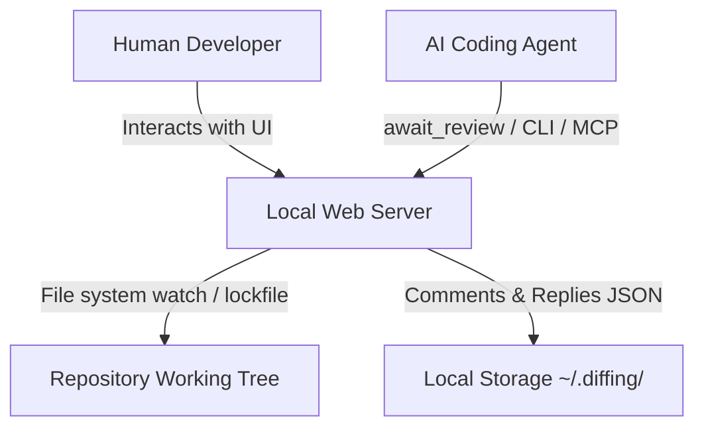

# Diffing CLI Reference Manual

This manual provides a detailed technical reference for the `diffing` command-line interface, its Model Context Protocol (MCP) server, and the underlying agent-user handoff protocol.

---

## 1. Core Concepts & Architecture

`diffing` is designed as a local-first, double-sided utility that serves both human developers and AI coding agents.



### Output Mode Auto-Detection
The primary `diffing` command determines how to output diff results based on whether stdout is interactive (a TTY) or a pipe/redirect:
- **Web Mode** (Default for interactive TTY): Launches a local review server, writes a discovery lockfile, and opens the browser with a high-fidelity PR-style review UI.
- **Terminal Mode** (Default for pipes, redirects, or non-TTY outputs): Behaves exactly like `git diff`. The command outputs standard patch text directly to stdout and exits.

You can explicitly force either mode using flags:
- `--web`: Forces the launching of the web review server.
- `--terminal`: Forces standard `git diff` output to terminal.

*Note: Any output format control flags (e.g. `--raw`, `--numstat`, `--stat`, `--exit-code`, `--quiet`, or `--output`) will implicitly force Terminal Mode.*

---

## 2. Port-Agnostic Server Discovery

When a `diffing` web server starts, it automatically registers itself by writing a lightweight lockfile (`server.json`) to a unique, repository-specific storage folder. 

This enables all agent subcommands, custom scripts, and the MCP server to find and communicate with the active web server without requiring the port to be hardcoded or passed manually.

### The Lockfile Location
The storage directory is computed by hashing the absolute path of the repository root:
```text
~/.diffing/<repo-name>-<sha256(repo-root-path).slice(0, 8)>/server.json
```

### Lockfile Schema
```json
{
  "port": 3433,
  "host": "127.0.0.1",
  "pid": 45192,
  "repoRoot": "/Users/developer/projects/my-app",
  "startedAt": 1782782782782,
  "version": "0.1.0",
  "mode": "web" | "tui" | "gh-pr",
  "prRef": "https://github.com/ahmedragab20/diffing/pull/1234"
}
```

- `mode` — `"web"` (default, local diff review), `"tui"` (Rust terminal UI), or `"gh-pr"` (GitHub PR review). Lets client subcommands detect a PR session without a port round-trip.
- `prRef` — present only when `mode === "gh-pr"`. The original `gh pr <ref>` input as the user typed it, for diagnostic round-trips.

### Self-Healing & Validation
To ensure stale lockfiles from terminated or crashed server processes do not block the CLI, client subcommands check the lock's validity via `isLockAlive`:
1. It probes the process using `process.kill(pid, 0)` (which checks for process existence without sending a termination signal).
2. It validates that the repository path registered in the lockfile matches the repository context of the executing CLI process.

If the lock fails either check, it is treated as dead, and the client reports that no server is running.

---

## 3. Command Line Interface Reference

### `diffing` (Primary Command)

Launches the review server or outputs terminal diffs. It serves as a drop-in replacement for `git diff` and accepts all standard git revisions, options, and pathspecs.

```bash
diffing [options] [<revision>...] [-- <path>...]
```

#### Diffing Server Options
- `--port <port>`: The port to bind the server to. If omitted, it automatically requests a random available port.
- `--host <host>`: Host address to bind the server to (default: `127.0.0.1`). Pass `0.0.0.0` to expose the review dashboard to your local network.
- `--no-open`: Prevents the CLI from automatically launching your browser when the server starts.
- `--gh-pr <ref>`: Open a GitHub PR review session instead of a working-tree diff. The `<ref>` accepts the same forms as `gh pr <ref>` (bare number, `owner/repo#N`, or full GitHub URL). Equivalent to the quoted form `diffing "gh pr <ref>"`. See [§4c. GitHub PR Review Subcommands](#4c-github-pr-review-subcommands) for the full flow.
- `--tui`: Open the opt-in native-Rust terminal UI instead of the web server. The same review flow (diff render, file tree, comments, agent handoff) in your terminal — no browser, no port. Strictly opt-in; without `--tui`, `diffing` behaves byte-identically to the previous releases. See [§4d. TUI Subcommands (Native Terminal UI)](#4d-tui-subcommands-native-terminal-ui) for the full flow.

#### Git-Compatible Flags Supported
- **Revisions / Range**: `--staged`, `--cached`, `--merge`
- **Diff Algorithms**: `--diff-algorithm=<algo>` (`minimal`, `patience`, `histogram`, `myers`), `--indent-heuristic`, `--no-indent-heuristic`, `--anchored=<text>`
- **Whitespace Controls**: `-b`/`--ignore-space-change`, `-w`/`--ignore-all-space`, `--ignore-blank-lines`, `--ignore-cr-at-eol`, `--ws-error-highlight=<kind>`
- **Context Lines**: `-U<n>`/`--unified=<n>`, `--inter-hunk-context=<n>`, `-W`/`--function-context`
- **Word-Level Diffs**: `--word-diff=<mode>` (`color`, `plain`, `porcelain`, `none`), `--word-diff-regex=<regex>`, `--color-words[=<regex>]`
- **Moved/Copied Detection**: `--color-moved=<mode>`, `--color-moved-ws=<mode>`, `-C`/`--find-copies`, `--find-copies-harder`, `-M`/`--find-renames`, `-B`/`--break-rewrites`
- **Output Formats**: `-p`/`--patch`, `-s`/`--no-patch`, `--raw`, `--numstat`, `--shortstat`, `--stat`, `--summary`, `--name-only`, `--name-status`, `--check`
- **Filtering**: `--diff-filter=<filter>`, `-S<string>`, `-G<regex>`, `--pickaxe-all`
- **Output Control**: `-o <file>`/`--output=<file>`, `--exit-code`, `--quiet`

---

## 4. Agent-Facing Subcommands

A specialized suite of subcommands is integrated into the `diffing` binary to coordinate handoffs and synchronize review cycles. These commands automatically discover the active server via the lockfile.

### `await-review`
Blocks the calling process until the user clicks **"Send to agent"** in the browser toolbar, then streams the review comments as XML to `stdout`.

```bash
diffing await-review [options]
```

- **Options**:
  - `-t, --timeout <seconds>`: Maximum duration to block (default: `570` seconds).
- **Behavior**:
  - Connects to the local server and establishes a long-polling request.
  - If a review is released, it prints the XML structured comments to `stdout` and prints the internal round number to `stderr` (`DIFFING_REVIEW_ROUND=N`).
- **Exit Codes**:
  - `0`: Success. Comments were successfully received and output.
  - `2`: Timeout. The timeout period elapsed without the user releasing the review.
  - `3`: No Server. No active diffing server was found for this repository.
  - `5`: Usage. Invalid arguments.

---

### `comments`
Dumps the current review comments database.

```bash
diffing comments [options]
```

- **Options**:
  - `--open`: Filter results to only output comments whose status is `"open"`.
  - `--json`: Format output as standard, structured JSON instead of the self-documenting agent XML.
- **Behavior**:
  - Returns a snapshot of comments at the moment of execution.

---

### `reply`
Appends a conversation reply to an existing comment thread.

```bash
diffing reply <commentId> [options]
```

- **Arguments**:
  - `<commentId>`: The UUID of the comment thread being replied to.
- **Options**:
  - `-b, --body <body>`: The body of the reply message. If `-` or omitted, the command reads the reply text from `stdin`.
  - `-m, --model <name>`: The name of the AI model posting the reply (e.g. `claude-3-5-sonnet`).
- **Exit Codes**:
  - `0`: Reply successfully registered.
  - `4`: Not Found. The requested `commentId` does not exist.
  - `5`: Usage. Missing body or invalid arguments.

---

### `resolve`
Marks a review comment thread as `"resolved"`. Resolving comments in the database updates the browser UI in real time.

```bash
diffing resolve <commentId>
```

- **Arguments**:
  - `<commentId>`: The UUID of the comment thread.
- **Exit Codes**:
  - `0`: Successfully marked as resolved.
  - `4`: Comment not found.

---

### `url`
Outputs the base URL of the active review server. Highly useful for external scripts making direct curl or HTTP requests.

```bash
diffing url
```

- **Behavior**:
  - Resolves the lockfile and outputs `http://127.0.0.1:<port>` to stdout.

---

## 4b. Plan-Review Subcommands

`diffing plan <action>` drives the **plan-review** handoff — the plan-side twin
of the comment review. An agent submits a markdown plan, blocks until the human
approves / rejects / requests changes, and acts on the verdict. All actions are
port-agnostic (resolved from the lockfile).

### `plan submit`
Submit (or resubmit) a markdown plan for review.

```bash
diffing plan submit <file> [--title T] [--source S] [--model M] [--id <id>] [--wait] [--timeout N] [--save-source]
cat PLAN.md | diffing plan submit                 # body via stdin (omit <file> or pass "-")
```

- `--title` — display title (defaults to the plan's first heading/line).
- `--source` / `--model` — origin label and authoring model, shown in the UI.
- `--id <id>` — resubmit a revised body for an existing plan: bumps `version`,
  resets the verdict to `pending`, and re-opens it for review.
- `--wait` — after submitting, block until the verdict arrives (combines
  `submit` + `await`); `--timeout` sets the total wait budget in seconds.
- `--save-source`, `-S` — after submission, save a copy of the submitted
  markdown body to `~/.diffing/<repo>/plan-sources/<id>.md`. This preserves the
  source file for later reference without polluting the consumer project's
  working tree.
- **Output**: the plan id on stdout; the review URL (`<base>/plan/<id>`) on
  stderr; source path on stderr when `--save-source` is used.

### `plan await`
Block until the human decides, then print the `<plan-review>` XML.

```bash
diffing plan await [--timeout N]
```

- **Exit codes**: `0` on a decision (XML on stdout); `2` (`DIFFING_PLAN_AWAIT_TIMEOUT`)
  if no decision arrives within the budget — call again to keep waiting.
- stderr carries `DIFFING_PLAN_DECISION=<verdict>` and `DIFFING_PLAN_ROUND=<n>`.

### `plan list`
List submitted plans.

```bash
diffing plan list [--json]
```

- Default: one tab-separated row per plan (`id  [decision]  vN  K open comment(s)  title`).
- `--json`: the raw plan array.

### `plan show`
Print a single plan.

```bash
diffing plan show [<id>] [--json]      # latest plan if <id> omitted
```

- Default: the `<plan-review>` XML. `--json`: the raw plan object.

### `plan reply`
Reply to an inline plan comment (the owning plan is resolved automatically).

```bash
diffing plan reply <commentId> --body "..." [--model <name>]
```

### `plan resolve`
Mark a plan comment resolved.

```bash
diffing plan resolve <commentId>
```

---

## 4c. GitHub PR Review Subcommands

`diffing gh <action>` drives the **GitHub PR review** flow — point `diffing`
at a pull request, draft inline + general comments in the same diff UI you
use for the working tree, then push the review to the actual PR via the
`gh` CLI (or a token fallback). The local comment handoff and the plan
handoff are both completely unaffected: PR-mode state lives in its own
`pr-session.json` sidecar, and all `/api/gh/*` routes 404 when no PR
session is active.

### Opening a PR review

All of these resolve to the same session (a web server pointed at PR #1234):

```bash
# Bare PR number, resolved against the cwd repo:
diffing "gh pr 1234"
diffing --gh-pr 1234

# Full URL form:
diffing "gh pr https://github.com/ahmedragab20/diffing/pull/1234"
diffing --gh-pr https://github.com/ahmedragab20/diffing/pull/1234

# owner/repo#N shorthand:
diffing "gh pr ahmedragab20/diffing#1234"
```

The quoted form (`diffing "gh pr <ref>"`) is matched *before* git diff
parsing, so the `pr` keyword never collides with a `git diff` revision.
The `--gh-pr` flag form is parsed by `parseDiffOptions` and merged.

On startup, the CLI:
1. Detects the PR session, sets `mode: "gh-pr"` and `prRef` in the lockfile.
2. Calls `gh pr view <ref> --json …` for metadata (title, author, base/head
   SHAs, additions/deletions/changedFiles, url).
3. Calls `gh pr diff <ref>` for the unified diff.
4. Calls `gh api /repos/{owner}/{repo}/pulls/{n}/comments?per_page=100` and
   `/reviews` to fetch existing review comments + their threads (read-only
   context, never re-POSTed). Pagination is capped at 50 reviews × 100
   comments — the first 50 reviews are fetched in detail, the rest
   summarised.
5. Persists `{ ref, owner, repo, pullNumber, baseSha, headSha, diff, files,
   existingComments, comments: [] }` to `pr-session.json`.
6. Opens the browser at `/gh/pr` (the SPA shell mounts `<PrReviewApp>`,
   which fetches `/api/gh/session` to hydrate).

If `gh` is missing and no `$GITHUB_TOKEN` is set, the session fails fast
with a clear one-line error — no silent degradation to a broken UI.

### `gh status`

Show the active PR session.

```bash
diffing gh status [--json]
```

- Default: a one-line summary (ref, owner/repo#n, comment count, submitted status).
- `--json`: the raw `PrSession` object (sans `diff`/`existingComments` to keep stdout small).
- **Exit codes**: `0` on success; `3` if no server / no PR session.

### `gh pr-fetch`

Re-fetch PR metadata (head SHA, diff, existing comments) and persist into
`pr-session.json`. Useful when the PR has been force-pushed since the
session started — the head SHA comparison surfaces "outdated" warnings.

```bash
diffing gh pr-fetch <ref> [--repo <owner/repo>]
```

- `--repo <owner/repo>`: explicit repo override (skips the cwd-repo
  detection for bare numbers).
- **Exit codes**: `0` on success; `3` if no server; `5` on bad input; `1`
  on `gh` failure (with the GitHub error message on stderr).

### `gh pr-list-comments`

Dump the in-progress PR-mode comments for the active session. Mirrors the
local `diffing comments` subcommand, but reads from `pr-session.json` (not
`comments.json`).

```bash
diffing gh pr-list-comments [--open] [--json]
```

- `--open`: only output comments with `status === "open"`.
- `--json`: structured JSON instead of the `<code-review-comments>` XML.

### `gh pr-review`

Submit the current in-progress PR review to GitHub. Headless equivalent
of clicking **Submit to GitHub** in the UI.

```bash
diffing gh pr-review <ref> --decision <approve|comment|request-changes> [--body <text>] [--dry-run]
```

- `--decision` (required) — the verdict event:
  - `approve` → GitHub event `APPROVE`
  - `request-changes` → GitHub event `REQUEST_CHANGES`
  - `comment` → GitHub event `COMMENT` (default when no decision is set
    but inline comments exist)
- `--body` (optional) — the general review comment, posted as the
  top-level review body.
- `--dry-run` — print the JSON payload that *would* be POSTed (the same
  `buildReviewPayload` output the UI submits) and exit. Never touches
  GitHub.
- **Auth precedence**: `gh` CLI (using your existing `gh auth login`)
  → `$GH_TOKEN` / `$GITHUB_TOKEN` / `$GITHUB_API_TOKEN` env var
  → fail with a clear one-line error.
- **Payload mapping**:
  - Each in-progress `ReviewComment` becomes a `{ path, line, side: "RIGHT", body }` entry. `path` is the PR-relative file path (no `a/` / `b/` prefix).
  - Multi-line comments (`startLineNumber` set) are **expanded** to N
    single-line entries with a `[part N/M]` prefix, because GitHub's REST
    endpoint doesn't support range anchors on a single review-comment.
  - File-level comments (`lineNumber === 0`) and resolved comments are
    dropped.
  - The `<ref>` argument is currently informational (the active session
    already knows its PR); included for symmetry with `pr-fetch` and
    for explicit overrides.
- **Response on success**:
  ```text
  Submitted review <id>
  <review-url>
  ```
  Plus `DIFFING_PR_REVIEW_ID=<id>` and `DIFFING_PR_REVIEW_URL=<url>` on stderr.
- **Exit codes**:
  - `0`: success.
  - `1`: GitHub rejected the payload (4xx/5xx); the error message is on stderr.
  - `3`: no server / no PR session.
  - `5`: usage error (missing `--decision`, bad value).
  - `6`: no auth (`gh` not on $PATH and no `$GITHUB_TOKEN`).

### Diffing ↔ GitHub payload mapping (reference)

For each in-progress `ReviewComment`:

| `diffing` field | GitHub field | Notes |
|---|---|---|
| `comment.filePath` | `path` | Stripped of any `a/` or `b/` prefix. |
| `comment.lineNumber` | `line` | Right-side (additions) line number. |
| `comment.side` | `side` | Always `"RIGHT"` in v1 (deletions-side anchors not posted). |
| `comment.body` | `body` | Multi-line comments expand to N entries with `[part N/M]` prefix. |
| `comment.status` | — | Only `open` comments are POSTed. |
| top-level `body` (from popover) | `body` | The general review comment. |
| `decision` (from popover) | `event` | `approve` → `APPROVE`, etc. |

The `pr-session.json`'s `existingComments` are **never** included in the
payload — they're a read-only context display in the UI, not part of the
submit body.

### `pr-session.json` Schema

Stored at `~/.diffing/<repo-name>-<hash>/pr-session.json`. The local
review flow (`comments.json`) and the plan review flow (`plans.json`) are
unaffected.

```json
{
  "ref": "https://github.com/ahmedragab20/diffing/pull/1234",
  "owner": "acme",
  "repo": "widget",
  "pullNumber": 1234,
  "headSha": "abc123…",
  "baseSha": "def456…",
  "title": "Add the widget",
  "url": "https://github.com/ahmedragab20/diffing/pull/1234",
  "author": { "login": "octocat", "avatarUrl": "https://…" },
  "additions": 142,
  "deletions": 7,
  "changedFiles": 5,
  "diff": "diff --git a/…",
  "comments": [ /* ReviewComment[] — the in-progress new ones */ ],
  "existingComments": [
    {
      "id": 9999,
      "author": { "login": "reviewer" },
      "body": "Pre-existing feedback",
      "path": "src/server.ts",
      "line": 42,
      "side": "RIGHT",
      "createdAt": "2026-05-01T12:00:00.000Z",
      "updatedAt": "2026-05-01T12:00:00.000Z",
      "state": "COMMENTED",
      "replies": [],
      "isOutdated": false
    }
  ],
  "submittedAt": 1782782782782,
  "submittedReviewId": 12345,
  "submittedReviewUrl": "https://github.com/ahmedragab20/diffing/pull/1234#pullrequestreview-12345",
  "authSource": "gh"
}
```

The server watches `pr-session.json` and broadcasts a `pr-session` SSE
event on every change (120ms debounce, mirroring the `comments.json` /
`plans.json` paths). The UI uses this for live updates: when a background
submit lands, the success toast and "Open in GitHub" link appear without
a manual refresh.

---

## 4d. TUI Subcommands (Native Terminal UI) — *Experimental*

> [!WARNING]
> The TUI is **experimental** in v0.3.0. The interface, keymap, and the
> on-disk shape of `server.json` (`mode: "tui"`) may change in a minor
> release before stabilisation. The web UI is the supported path for
> production workflows; please open an issue before depending on the TUI
> for CI / agent automation. The web review flow, plan review, and PR
> review are unaffected by the experimental status of the TUI.

`diffing --tui` opens the opt-in **native-Rust terminal UI** — a leaf renderer
in `crates/diffing-tui/` that reads the same `~/.diffing/<repo>/*` state on
disk and writes `server.json` with `mode: "tui"`. The Node CLI remains the
single source of truth for arg parsing, lockfile discovery, and agent
handoff; the TUI binary is a self-contained `ratatui` + `crossterm`
renderer that watches the same `comments.json` and writes back through the
same atomic file APIs.

```bash
diffing --tui                       # Open current working tree in the TUI
diffing --tui --staged              # Review staged changes in the TUI
diffing --tui HEAD~3                # Working tree vs. 3 commits ago
diffing --tui main..feature         # Compare two branches
diffing --tui -- -- src/           # Limit to a directory
```

### TUI launch semantics

- The default `diffing` behaviour is **byte-identical** with and without
  `--tui`. The flag is strictly opt-in.
- If the env cannot support a TUI (piped stdin, CI, no raw mode) the CLI
  prints one line to stderr (`diffing --tui requires a TTY; falling back
  to git diff`) and runs the normal `git diff` output.
- If the `diffing-tui` binary is missing or fails to start, the CLI prints
  one line to stderr (`diffing-tui binary not found; build it with
  pnpm build:tui; falling back to git diff`) and runs the normal `git
  diff` output. The web mode is unaffected by the TUI build — the same
  `diffing` install serves either.

### Binary discovery

The CLI searches for the `diffing-tui` binary in this order, anchoring on
the bundled `dist/cli.mjs` directory:

1. Sibling of the bundled CLI (`dist/diffing-tui[.exe]`)
2. `bin/diffing-tui[.exe]` next to the package root
3. `target/release/diffing-tui[.exe]` (release build)
4. `target/debug/diffing-tui[.exe]` (debug build — a plain `cargo build`
   is enough to use the TUI; no `--release` required)
5. `$PATH` lookup via `where` (Windows) / `which` (POSIX)

### Lockfile integration

The TUI writes the same `server.json` lockfile the web server writes,
with `mode: "tui"` instead of `mode: "web"`. The lockfile is therefore
discoverable by every existing agent subcommand and MCP tool — the only
visible difference is `mode: "tui"` in the JSON, which existing clients
already accept (they treat it as "web-equivalent" for comment-store and
harness purposes).

Stale-lock detection uses `is_lock_alive`, which on Unix probes with
`kill(pid, 0)` and on Windows probes with `tasklist /NH /FO CSV /FI
"PID eq N"`. There is no platform-specific caveat for the user — a stale
lock is detected and replaced on every supported host.

### Keymap (vim-style)

The TUI mirrors the web UI's vim-style motions and adds the comment
shortcuts. The status bar at the bottom shows the current mode (NORMAL /
INSERT), the active file path, and the agent-status dot.

| Key | Action |
|---|---|
| `j` / `k` | Scroll down / up |
| `gg` / `G` | Jump to top / bottom of diff |
| `Ctrl+d` / `Ctrl+u` | Half-page down / up |
| `J` / `K` | Next / previous file |
| `Tab` | Toggle focus between file tree and diff |
| `w` | Toggle line wrap |
| `t` | Cycle tab size (2 → 4 → 8) |
| `m` | Toggle split / unified view |
| `/` | Open text search palette |
| `?` | Open shortcuts help |
| `c` | New comment on the current line |
| `e` | Edit the current comment |
| `r` | Reply to the current comment thread |
| `x` | Resolve the current comment |
| `]` / `[` | Jump to the next / previous open comment thread |
| `Esc` | Exit insert / popover mode |
| `q` | Quit |

### Comment workflow

The TUI implements full `ReviewComment` CRUD — it does not call back into
the Node server for comment operations, but it shares the same
`comments.json` file path and the same JSON shape as the web UI. The
following operations are byte-identical between the two clients:

- Creating a new inline / multi-line / file-level comment.
- Editing a comment's `body` or `status` (`open` / `resolved`).
- Appending a reply (`role: "user"` for the human, with the model
  recorded if set).
- Resolving a comment.
- Deleting a comment or reply.

The TUI watches `comments.json` (120ms debounce) and broadcasts every
change through the same atomic-write protocol the web server uses, so a
comment created in the TUI shows up in the browser instantly when both
clients are open, and vice versa.

### Send review & agent handoff

The TUI's "send review" popover (verdict radios + general-comment field +
live XML preview) calls the same `format_comments` Rust port that the web
UI uses — the output is byte-identical to `<code-review-comments>`. On
send it:

1. Snapshots the current comment store.
2. Writes `pending-review.xml` to `~/.diffing/<repo>-<hash>/` (mirroring
   the web UI's handoff protocol).
3. Copies the XML to the system clipboard using the platform's
   preferred tool: `pbcopy` on macOS, `wl-copy` (Wayland) → `xclip` →
   `xsel` (X11) on Linux, `clip.exe` (with CRLF endings) → PowerShell
   `Set-Clipboard` on Windows.
4. Increments the review-session `round` and refreshes `server.json`
   with `mode: "tui"`.
5. Updates the agent-status dot in the status bar.

**Known limitation** — the TUI's "Send to agent" writes the review to
disk + clipboard but does not actively unblock a long-polling `diffing
await-review` (which would require a Node-side change in a follow-up).
The web UI's send button remains the supported native handoff path. The
`pending-review.xml` is still produced and the review session is still
round-incremented — only the long-poll wake-up is missing.

### Cross-platform notes

- **macOS** — clipboard via `pbcopy`. The TUI binary links against the
  system libc and requires no extra setup.
- **Linux** — clipboard via `wl-copy` (Wayland), `xclip` (X11), `xsel`
  (X11 fallback). The TUI prefers `wl-copy` on systems where both
  Wayland and X11 tools are installed, so a Wayland-only session never
  silently falls into an X11 tool.
- **Windows** — clipboard via `clip.exe` (with `\n` → `\r\n` conversion
  for proper pasting) or PowerShell `Set-Clipboard` as a fallback. The
  liveness probe uses `tasklist /NH /FO CSV` so a stale lock is
  detected and replaced automatically.

### Building the TUI from source

```bash
pnpm build:tui               # debug → target/debug/diffing-tui
pnpm build:tui --release     # release → target/release/diffing-tui
```

The `crates/diffing-tui/` crate is a member of the workspace at
`Cargo.toml`. `cargo fmt` + `cargo clippy --all-targets -- -D warnings` +
84 cargo tests all pass before release.

---

`diffing` bundles a self-describing MCP server over standard I/O (stdio).
Initialization instructions, typed tool schemas, annotations, prompts, and a
guide resource let unfamiliar agents discover both review loops without relying
on vendor-specific setup.

### Launching the MCP Server
```bash
diffing mcp
diffing mcp --repo /absolute/path/to/repository
diffing mcp --help
```

### Client Configuration Example
Add the server configuration to your MCP settings file (e.g. `claude_desktop_config.json` or Cursor's MCP configurations):

```json
{
  "mcpServers": {
    "diffing": {
      "command": "diffing",
      "args": ["mcp"]
    }
  }
}
```

No port is configured. The MCP process binds to one repository and can start a
headless review server on loopback with a random port. Repository selection is
an explicit `--repo` when provided, otherwise the Git repository containing the
MCP process working directory. Invalid selection fails instead of guessing.

### MCP Tool Schema Reference

Every successful tool call returns readable text and schema-validated
`structuredContent`. Local operations advertise `openWorldHint: false`; status
and read operations are marked read-only, while mutation retry semantics are
declared explicitly.

| Area | Tools | Purpose |
|------|-------|---------|
| Session | `review_session_status`, `start_review_session` | Inspect the bound repository and live server; idempotently start or reuse a loopback session |
| Diff review | `get_diff`, `create_comment` | Read the complete unified diff and post typed inline findings without raw HTTP |
| Human handoff | `await_review`, `list_comments`, `reply_to_comment`, `resolve_comment` | Receive verdict/comments and synchronize the discussion in real time |
| Plan review | `submit_plan`, `await_plan_review`, `list_plans`, `get_plan`, `get_plan_versions`, `get_plan_version`, `reply_to_plan_comment`, `resolve_plan_comment` | Gate implementation on a versioned human-reviewed plan |

`start_review_session` accepts an optional array of safe git-diff scope,
filtering, whitespace, context, and rename-detection arguments. Output files,
external/textconv drivers, non-patch formats, and diffing runtime/network flags
are rejected before parsing. The tool never constructs a shell command, never
replaces an incompatible user-owned session, and binds MCP-owned sessions to
`127.0.0.1`. Diff modifiers require an explicit revision or pathspec anchor;
baseline working-tree mode accepts only staged/cached selection.

The await tools return `status: "released" | "timeout"` in structured content.
Timeout is an expected retry state. Released results include `mode`; when the
mode is `comment-only`, the agent must reply without editing files.

### MCP Prompts and Resource

- `review_local_changes` guides an agent through status/start, full diff
  inspection, and actionable inline comments.
- `submit_plan_for_review` guides the versioned submit/await/verdict loop.
- `diffing://agent-guide` is a static, client-readable workflow reference.

These are supplemental. Essential behavior remains in initialization
instructions and tool descriptions for clients that expose tools only.

GitHub PR automation remains available through the `diffing gh ...` CLI
subcommands; no `gh_pr_*` MCP tools are currently advertised.

---

## 6. The Agent-User Handoff Protocol

The synchronization loop relies on an **"agent waits, human releases"** pipeline. It operates as an asynchronous barrier between the AI agent and the human developer.

```text
 Agent                                          Local Web Server                               Human UI
   │                                                   │                                          │
   │── [1] await-review (long-poll) ──────────────────>│                                          │
   │   (Agent blocks & enters sleep state)            │                                          │
   │                                                   │                                          │
   │                                                   │ <── [2] Writes inline comments ──────────│
   │                                                   │                                          │
   │                                                   │ <── [3] Click "Send to Agent" ───────────│
   │                                                   │                                          │
   │<── [4] Releases long-poll with XML Comments ──────│                                          │
   │                                                   │                                          │
   │── [5] Performs edits & fixes ────────────────────>│                                          │
   │── [6] Calls 'reply' / 'resolve' ─────────────────>│ ── [7] Live SSE update ────────────────> │
```

### The Long-Polling Synchronization Mechanism
Synchronizing an offline/local agent process with a browser-based UI is achieved via a dedicated long-polling server controller, backed by a monotonic sequence:

1. **State Machine (`ReviewSession`)**:
   Monitors the current review session. Key properties are:
   - `round`: A monotonic integer incremented on every human-triggered "Send to agent" release.
   - `lastPayload`: A cache of the most recent XML and JSON comments payload.
   - `waiters`: A registry of pending long-polling HTTP connections.

2. **The Long-Poll Endpoint (`GET /api/review/await`)**:
   The client polls this endpoint, providing standard parameters:
   - `timeoutMs`: The length of time to keep the request alive (server caps this at `50000`ms to prevent proxy dropouts).
   - `sinceRound`: The round index the client last processed.

3. **Race-Guard Logic (Monotonic Sequence)**:
   To prevent reviews from being lost if a human clicks "Send to agent" during the split-second window when an agent is reconnecting between two polls:
   - When a poll arrives, if `sinceRound < currentRound`, the server recognizes the client is out of sync. It **immediately resolves** the request by returning the cached `lastPayload`.
   - If `sinceRound === currentRound`, the client is fully caught up. The server parks the request by creating a `Promise` resolver, adding the connection to the `waiters` pool, and keeping it open.

4. **The Release Endpoint (`POST /api/review/send`)**:
   Triggered when the human clicks "Send to agent" in the toolbar:
   - Increments the session's `round` sequence.
   - Snapshots the current comment database.
   - Flushes the `waiters` registry, resolving every parked HTTP connection instantly with the new XML payload.
   - Broadcasts the `agent-status` event via SSE to inform the UI that the waiting agent has been released (updating the toolbar connection dot).

### Live Bidirectional Synchronization
- **Server-Sent Events (SSE)**:
  Connected UI browser clients listen to the `/api/live` event stream. When the agent posts replies or marks comments resolved (via the CLI or MCP tools), the server broadcasts a `comments` update event.
- **File Watching (`comments.json`)**:
  The comments database is written to `comments.json` in the per-project storage directory. The server maintains an active file watcher on this directory. Any manual edits or external updates to `comments.json` instantly trigger an SSE broadcast, updating the browser UI in real time.

---

## 7. Practical Integration Patterns

### Custom Developer Shell Alias
For developers who want an incredibly fast git workflow, you can add this alias to your shell profile (`.zshrc` or `.bashrc`):

```bash
# Review current unstaged changes
alias gd="diffing"

# Review staged changes only
alias gds="diffing --staged"

# Complete review and await agent workflow
alias gda="diffing & diffing await-review"
```

### Git Alias Configuration
You can register `diffing` as a native git custom subcommand by placing the following in your `~/.gitconfig`:

```ini
[alias]
    review = !diffing
```

Now, running `git review` inside any repository will spin up the interactive browser review server.

---

## 8. Rust-Powered Search Engine (powered by fff)

`diffing` bundles a high-performance, native code search engine powered by `@ff-labs/fff-node` (a native Rust fuzzy file finder and live grep module). Because it runs natively inside Node.js as a Rust addon, it performs exceptionally fast searches across large codebases.

### Architectural Strategy
1. **Platform Independence & Isolation**: The native Rust binary is loaded dynamically via ES import hooks within the server's search initializer. If a platform is incompatible or the binary is missing, search capabilities degrade gracefully (reporting search as unavailable via API) instead of crashing the primary `diffing` Hono web server.
2. **SQLite-Backed Frecency & History**: Search history is preserved across restarts inside the `~/.diffing/<repo-name>-<sha256(repo-root-path).slice(0, 8)>/fff/` database directory using two lightweight databases (`frecency.db` and `history.db`).
3. **Automatic Watchers**: `@ff-labs/fff-node` handles its own high-efficiency file system watcher, ensuring search indices stay fully up-to-date in real time as files change in the repository working tree during code review.

### Search Scopes
The engine exposes four powerful search scopes via its JSON query payload:
- **Files Fuzzy Search** (`scope: 'files'`): Perform rapid, error-tolerant fuzzy matching on workspace paths.
- **Text Grep Search** (`scope: 'text'`): Search across all workspace lines using raw case-insensitive strings or high-performance Rust regular expressions.
- **Symbols Search** (`scope: 'symbols'`): Locates method declarations, class definitions, and variable identifiers, which are syntactically classified server-side based on their language patterns.
- **Concurrently Unified Search** (`scope: 'all'`): Query all three indexes concurrently to return a mixed list of fuzzy file matches, text greps, and symbol hits.

### The Search HTTP API (`POST /api/search`)
Used by connected review tools to query the engine.

- **Payload Schema**:
```json
{
  "scope": "all | files | text | symbols",
  "query": "search-query-string",
  "limit": 60,
  "regex": false,
  "changedPaths": ["src/cli.ts", "src/server.ts"]
}
```

- **Specialized Filters**:
  - `changedPaths` (optional array of strings): Engaging this filter limits search boundaries exclusively to the specified paths (e.g. only matching files changed in the current git diff / PR).
  - `regex` (optional boolean): Enables raw regular expression grep parsing during `text` queries.
  - Frecency is updated live by sending user selections to `POST /api/search/track` featuring `query` and `path` parameters, boosting scoring weight for future queries.

---

## 9. Comment XML Serialization & Schema Specification

When review comments are exported (either via copying from the UI clipboard or received during `await-review`), `diffing` formats them into an optimized XML document that includes self-documenting agent instructions.

### Complete XML Schema Elements

1. **`<code-review-comments>` (Root Node)**: The container for the entire review session export.
2. **`<instructions>`**: Nested system prompt instructing the AI assistant on how to interpret review comments, resolve lines, and post replies.
3. **`<general-comment>` (Optional)**:
   - **Purpose**: Provides a high-level summary or general feedback about the entire review round rather than targeting a specific line of code.
   - **Serialization**: Wrapped inside a `<![CDATA[ ... ]]>` block to safely support rich markdown layout, paragraphs, and list elements.
   - **Position**: Placed immediately after `<instructions>` and before the first `<file>` tag.
4. **`<file path="...">`**: Groups all comments associated with a specific file path (relative to the repository root).
5. **`<comment id="..." line="..." side="..." status="..." created-at="...">`**: An individual inline comment thread.
   - **`id`**: Unique UUID of the comment.
   - **`line`**: The line target attribute. Supports three distinct formats:
     - **Single-Line Select** (e.g. `line="15"`): Comment is anchored on line 15.
     - **Multi-Line Select** (e.g. `line="10-15"`): Comment spans a range from line 10 to 15.
     - **Whole-File Target** (e.g. `line="file"`): Comment is a general file-level note (where line number is 0).
   - **`side`**: Indicates the target branch of the diff. Either `"additions"` (added/modified code) or `"deletions"` (deleted/old code).
   - **`status`**: Current resolution state. Either `"open"` or `"resolved"`.
   - **`created-at`**: ISO-8601 timestamp of when the comment thread was opened.
6. **`<code>` (Optional)**:
   - **Purpose**: Captures the exact code context target.
   - **Format**:
     - **Single-line**: Prefixed with `+` or `-` depending on the side (e.g. `+ const x = y;`).
     - **Multi-line**: Formatted as a multi-line string inside CDATA where *each individual line* is prefixed with `+` or `-` (e.g. `+ line1\n+ line2`).
     - **File-level**: The `<code>` node is completely omitted when `line="file"`.
7. **`<body>`**: The markdown content of the comment thread, safely wrapped in CDATA.
8. **`<replies>` (Optional)**: Groups chronological replies to the comment thread.
9. **`<reply id="..." created-at="..." role="..." model="...">`**:
   - **`id`**: Reply UUID.
   - **`role`**: The poster's identity. Either `"user"` (human developer) or `"agent"` (AI coding assistant).
   - **`model`**: If the reply was posted by an agent, this attribute records the name of the LLM that made the reply.

### Comprehensive XML Structure Example

```xml
<code-review-comments>
  <instructions>
    You are an AI coding assistant. You are receiving a structured list of code review comments to address in the repository.
    ...
  </instructions>
  <general-comment>
    <![CDATA[Overall, excellent improvements. Please ensure to fix the multi-line parsing edge cases mentioned in the parser file.]]>
  </general-comment>
  <file path="src/utils/parser.ts">
    <!-- Multi-Line Addition Comment -->
    <comment id="c1" line="42-45" side="additions" status="open" created-at="2026-05-24T22:00:00.000Z">
      <code><![CDATA[
+ const parsedToken = tokenize(input);
+ if (parsedToken.type === 'EOF') {
+   return null;
+ }
]]></code>
      <body><![CDATA[Refactor this tokenization block to check for undefined inputs as well.]]></body>
      <replies>
        <reply id="r1" created-at="2026-05-24T22:05:00.000Z" role="agent" model="claude-3-5-sonnet">
          <![CDATA[Understood, I will add a guard clause for undefined.]]>
        </reply>
      </replies>
    </comment>

    <!-- Whole-File General Comment -->
    <comment id="c2" line="file" side="additions" status="open" created-at="2026-05-24T22:08:00.000Z">
      <body><![CDATA[This parser module needs additional unit tests to cover negative bounds.]]></body>
    </comment>
  </file>
</code-review-comments>
```

---

## 10. Settings & User Configuration

User-specific preferences, layout options, editor choices, and themes are persisted across review sessions in a central settings file.

- **Storage Location**: `~/.config/diffing/settings.json`
- **JSON Configuration Schema & Default Settings**:
```json
{
  "staged": true,                    // Include staged changes by default in web mode
  "untracked": true,                 // Include untracked files by default in web mode
  "diffStyle": "split",              // Layout presentation ("split" or "unified")
  "defaultTabSize": 4,               // Fallback tab size if .editorconfig is not found
  "theme": "nord",                   // Core visual theme (Nord, Tokyo Night, Catppuccin, rose-pine, etc.)
  "editorIDE": "default",            // Target IDE to open files in ("default", "vscode", "zed", "vim", "neovim")
  "lineDiffType": "word",            // Pinpoint difference algorithm ("word", "word-alt", "char", "none")
  "lineWrap": false,                 // Soft-wrap long source lines to fit page
  "diffIndicators": "classic",       // Margin line indicators ("classic" (+/-), "bars", "none")
  "showLineNumbers": true,           // Toggle gutter line numbers
  "hunkSeparators": "line-info",     // visual style of dividers between hunks
  "lineHoverHighlight": "both",      // Highlight on hover ("both", "line", "number", "disabled")
  "fontSize": 13,                    // Base code editor font size (in pixels)
  "expandContextByDefault": false,   // Automatically load and expand full file context
  "collapsedContextThreshold": 10,   // Context lines gap before collapsing is applied
  "expansionLineCount": 20,          // Context lines revealed per click on expand up/down
  "haptics": true                    // Interface sound effects and tactile feedback triggers
}
```

---

## 11. Web API Reference

The local server exposes a powerful REST HTTP API to allow the web frontend dashboard and local AI agent scripts to synchronize comments, track status, mutate the working tree, and launch editors.

### 1. Handoff & Synchronization Loop

#### `POST /api/review/send`
Releases all waiting agent processes (blocked in `/api/review/await`) by incrementing the monotonic `round` sequence and broadcasting the snapshots.
- **Payload Schema**:
  ```json
  {
    "generalComment": "Optional high-level markdown text summarizing this review round"
  }
  ```
- **Response Schema**:
  ```json
  {
    "ok": true,
    "round": 4,
    "openCount": 2,
    "waiters": 0
  }
  ```

#### `GET /api/review/await`
A long-poll endpoint used by CLI subcommands and MCP tools to block until a review is released.
- **Query Parameters**:
  - `sinceRound` (number, required): The last round processed by the client.
  - `timeoutMs` (number, default: `25000`): Maximum server hold time. Server caps this to `50000`ms to prevent intermediate proxy dropouts.
- **Response Schema (on release)**:
  ```json
  {
    "status": "released",
    "round": 4,
    "payload": {
      "sentAt": 1782782782782,
      "commentXml": "<code-review-comments>...</code-review-comments>",
      "openCount": 2,
      "comments": [...]
    }
  }
  ```

#### `GET /api/review/status`
Queries a snapshot of the current review session state.
- **Response Schema**:
  ```json
  {
    "round": 4,
    "waiters": 0,
    "lastPayload": { ... }
  }
  ```

---

### 2. Comments & Replies System

#### `GET /api/comments`
Fetches a list of all current code review comment threads.
- **Response Schema**: Array of `ReviewComment` objects.

#### `POST /api/comments`
Opens a new inline comment thread on a line of code.
- **Payload Schema**:
  ```json
  {
    "filePath": "src/lib/git.ts",
    "side": "additions | deletions",
    "lineNumber": 142,
    "startLineNumber": 140,            // Supports range select
    "lineContent": "The exact source line context",
    "body": "Markdown comment message"
  }
  ```

#### `PUT /api/comments/:id`
Updates an existing comment thread body or toggles its status.
- **Payload Schema**:
  ```json
  {
    "body": "Updated markdown comment message",
    "status": "open | resolved"
  }
  ```

#### `DELETE /api/comments/:id`
Permanently deletes a comment thread.

#### `POST /api/comments/:id/replies`
Appends a conversation reply to an existing comment thread.
- **Payload Schema**:
  ```json
  {
    "body": "Reply message body",
    "role": "user | agent",
    "model": "claude-3-5-sonnet"       // Required if role is agent
  }
  ```

#### `PUT /api/comments/:id/replies/:replyId`
Updates the body text of a comment reply.

#### `DELETE /api/comments/:id/replies/:replyId`
Deletes a comment reply.

#### `POST /api/comments/:id/apply-suggestion`
Parses a Markdown ```suggestion code block inside the comment body, applies the proposed lines of code to the physical working tree file, and marks the comment thread as `resolved`.

---

### 3. File Attachments & Media

#### `POST /api/attachments`
Uploads a pasted image file from the clipboard or file picker.
- **Payload**: Multi-part Form Data containing a `file` field.
- **Response Schema**:
  ```json
  {
    "url": "/api/attachments/pasted_image_de4f55-bc11...png"
  }
  ```

#### `GET /api/attachments/:filename`
Serves an uploaded attachment file. Uploads are strictly isolated and stored inside `~/.diffing/<repo-name>-<hash>/attachments/`.

---

### 4. Git Operations & IDE Integration

#### `POST /api/open-file`
Launches the developer's preferred editor to target the specified file.
- **Payload Schema**:
  ```json
  {
    "filePath": "src/server.ts",
    "editor": "vscode | zed | vim | neovim | default"
  }
  ```

#### `POST /api/revert-hunk`
Performs hunk-level reverts. The server extracts the hunk patch from the working tree, constructs a minimal patch, and applies it in reverse (`git apply --reverse`).
- **Payload Schema**:
  ```json
  {
    "filePath": "src/server.ts",
    "hunkIndex": 2
  }
  ```

#### `GET /api/hunk-history`
Gathers context regarding deleted lines. Retrieves `git blame` annotations for the target deletion range and extracts the last 5 commits affecting the file to locate who authored the code and when it was introduced.
- **Query Parameters**:
  - `filePath` (string, required): File path relative to repo root.
  - `deletionStart` (number, required): Line number index where the deleted block started.
  - `deletionCount` (number, required): Total count of deleted lines.

#### `POST /api/save-file`
Writes updated code to disk and optionally stages it in git.
- **Payload Schema**:
  ```json
  {
    "filePath": "src/lib/git.ts",
    "content": "Full source file contents...",
    "gitAdd": true                     // Automatically runs git add on the file
  }
  ```

#### `GET /api/merge-status`
Probes if the working tree has merge conflicts (`.git/MERGE_HEAD` exists) and returns a list of files currently in conflict state.
- **Response Schema**:
  ```json
  {
    "inMerge": true,
    "conflicts": ["src/main.ts", "package.json"]
  }
  ```

#### `GET /api/repo-files`
Returns a sorted list of all active files under the repository working tree (tracked + untracked), excluding paths specified in `.gitignore`.

#### `GET /api/file-text`
Retrieves a file version as text. Includes a `missing` indicator in the JSON output if the requested revision version is missing (such as deleted files or new files).
- **Query Parameters**:
  - `path` (string, required)
  - `version` (string, required): `"old" | "new"`

#### `GET /api/settings` / `PUT /api/settings`
Retrieves or overwrites the global user configuration stored in `~/.config/diffing/settings.json`.

### 5. Plan Review

Plans are persisted to `plans.json` in the per-repo storage dir (watched for live
`plans` SSE broadcasts). The verdict handoff mirrors the comment handoff but uses
the `PlanReviewSession` and a separate long-poll endpoint.

#### `GET /api/plans` / `GET /api/plans/:id`
Returns all plans, or a single plan (404 if unknown). Each plan carries
`{ id, title, body, source?, model?, version, decision, decisionComment?, decidedAt?, createdAt, updatedAt, comments[] }`.

#### `POST /api/plans`
Creates a plan, or revises one when `id` matches an existing plan (version bump,
verdict reset to `pending`). Returns the plan (201).
- **Payload Schema**:
  ```json
  {
    "body": "# My Plan\n## Phase 1\n…",   // required (markdown)
    "title": "Refactor the parser",        // optional (defaults to first heading/line)
    "source": "claude-code",               // optional origin label
    "model": "claude-opus-4-8",            // optional authoring model
    "id": "<existing-plan-id>"             // optional → revise instead of create
  }
  ```

#### `PUT /api/plans/:id` / `DELETE /api/plans/:id`
Updates a plan's `title`/`body`/`source`/`model`, or deletes a plan.

#### `POST /api/plans/:id/comments`
Adds an inline comment. `lineNumber: 0` marks a whole-plan comment; `startLineNumber`
makes it a range. When `lineContent`/`sectionTitle` are omitted, the server derives
them from the plan body (the anchored text and nearest preceding heading). Returns
the updated plan (201).
- **Payload Schema**:
  ```json
  {
    "lineNumber": 4,                 // 0 = whole-plan comment
    "startLineNumber": 3,            // optional (multi-line range)
    "body": "Clarify this step.",
    "lineContent": "…",             // optional (auto-derived)
    "sectionTitle": "Phase 1"        // optional (auto-derived)
  }
  ```

#### `PUT /api/plans/:id/comments/:commentId` / `DELETE …`
Edits a comment's `body`/`status`, or deletes it.

#### `POST /api/plans/:id/comments/:commentId/replies` / `PUT … /replies/:replyId` / `DELETE … /replies/:replyId`
Adds, edits, or deletes a reply. A `model` in the payload attributes the reply to `role: "agent"`.

#### `POST /api/plans/:id/decision`
The human's verdict. Records the decision on the plan **and** releases every agent
blocked on `/api/plan-review/await`.
- **Payload Schema**:
  ```json
  {
    "decision": "approved | rejected | changes-requested",   // required
    "decisionComment": "Optional overall note"
  }
  ```
- **Response**: `{ ok, round, decision, openCommentCount, waiters }`.

#### `GET /api/plan-review/await`
Long-poll for the next plan decision. Same `sinceRound` / `timeoutMs` mechanics as
`/api/review/await`. Returns `{ status: "released", payload }` (payload includes
`reviewXml`, `decision`, `decisionComment`, `planId`, `openCommentCount`, `plan`)
or `{ status: "keep-waiting", round }`.

#### `GET /api/plan-review/status`
Returns `{ round, waiters, lastDecidedAt }` for the plan handoff session.

---

### 6. GitHub PR Review

All `/api/gh/*` endpoints are **no-ops (404)** when no `pr-session.json`
exists, so the local review flow and the plan review flow are completely
unaffected. Every response shape below assumes an active PR session.

#### `GET /api/gh/session`
Returns the active `PrSession` (sans the large `diff` string) for client hydration.
- **Response Schema**:
  ```json
  {
    "prMode": true,
    "ref": "https://github.com/ahmedragab20/diffing/pull/1234",
    "owner": "acme",
    "repo": "widget",
    "pullNumber": 1234,
    "baseSha": "def456…",
    "headSha": "abc123…",
    "title": "Add the widget",
    "url": "https://github.com/ahmedragab20/diffing/pull/1234",
    "author": { "login": "octocat" },
    "additions": 142,
    "deletions": 7,
    "changedFiles": 5,
    "existingComments": [ /* PrExistingComment[] — read-only context */ ],
    "submittedAt": null,
    "submittedReviewId": null,
    "submittedReviewUrl": null,
    "authSource": "gh"
  }
  ```

#### `POST /api/gh/pr/init`
Initialise a PR session from a `ref` (programmatic equivalent of `diffing --gh-pr <ref>`).
- **Payload Schema**:
  ```json
  { "ref": "https://github.com/ahmedragab20/diffing/pull/1234" }
  ```
- **Response Schema** (200):
  ```json
  {
    "ok": true,
    "ref": "https://github.com/ahmedragab20/diffing/pull/1234",
    "owner": "acme",
    "repo": "widget",
    "pullNumber": 1234,
    "url": "https://github.com/ahmedragab20/diffing/pull/1234"
  }
  ```
- **Errors**: 400 if `ref` is missing; 500 on `gh` failure (with the GitHub error message).

#### `POST /api/gh/pr/refresh`
Re-fetches PR metadata (head SHA, diff, existing comments) and persists the result. Surfaces force-pushes by changing `headSha`.
- **Response Schema** (200): `{ ok: true, headSha: "…" }`.

#### `GET /api/gh/pr-session/comments`
Returns the in-progress PR-mode `ReviewComment[]`. Mirrors `GET /api/comments` but reads from `pr-session.json`.

#### `POST /api/gh/pr-session/comments`
Append a new PR-mode inline comment.
- **Payload Schema**:
  ```json
  {
    "filePath": "src/server.ts",
    "side": "additions",
    "lineNumber": 142,
    "startLineNumber": 140,        // optional, for range select
    "lineContent": "const x = …",
    "body": "Markdown comment"
  }
  ```
- **Response**: 201 with the saved comment.

#### `PUT /api/gh/pr-session/comments/:id`
Edit a PR-mode comment's `body` or `status` (open/resolved).

#### `DELETE /api/gh/pr-session/comments/:id`
Delete a PR-mode comment.

#### `POST /api/gh/pr-session/comments/:id/replies`
Append a reply to a PR-mode comment (same shape as `/api/comments/:id/replies`).

#### `POST /api/gh/submit`
Build the `POST /repos/{owner}/{repo}/pulls/{n}/reviews` payload from the
current `pr-session.json` comments, POST it to GitHub, and on success
record `submittedAt` / `submittedReviewId` / `submittedReviewUrl` on the
session. This is the server-side equivalent of `diffing gh pr-review`.
- **Payload Schema**:
  ```json
  {
    "decision": "approve | comment | request-changes",
    "body": "Optional general review comment",
    "dryRun": false
  }
  ```
- **Response Schema** (200):
  ```json
  {
    "ok": true,
    "reviewId": 12345,
    "reviewUrl": "https://github.com/ahmedragab20/diffing/pull/1234#pullrequestreview-12345",
    "failedComments": 0,
    "authSource": "gh",
    "dryRun": false
  }
  ```
- **Errors**: 400 on bad `decision`; 500 on `gh` failure; the response body
  always carries the error message + the auth source that was tried.

#### `GET /api/diff` (PR-mode short-circuit)

When a PR session is active, `GET /api/diff` short-circuits to return the
PR patch instead of the working-tree diff. The response gains a `prMode`
flag plus PR metadata fields:
- **Response Schema** (PR mode):
  ```json
  {
    "patch": "diff --git a/…",
    "repoName": "widget",
    "branch": "#1234",
    "customMode": true,
    "binaryFiles": [],
    "tabSizeMap": {},
    "untrackedFiles": [],
    "prMode": true,
    "prRef": "https://github.com/ahmedragab20/diffing/pull/1234",
    "prOwner": "acme",
    "prRepo": "widget",
    "prPullNumber": 1234,
    "prUrl": "https://github.com/ahmedragab20/diffing/pull/1234",
    "prTitle": "Add the widget",
    "prAuthor": { "login": "octocat" },
    "prHeadSha": "abc123…",
    "prBaseSha": "def456…"
  }
  ```
In local mode, the response is byte-identical to the original (no `prMode`
field), so the existing local review client is unaffected.
